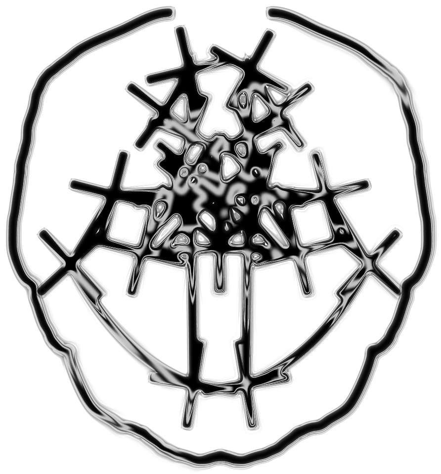

## Hai everynyan!

<blockquote> 

*Playing on my computer*

</blockquote>

 
 

## *About me* 
I'm a freaking designer, audio engineer & software development student currently studying at <a href=https://wethinkcode.co.za> WeThinkCode_ </a> :snake: :coffee: :crab:

I want to help design beautiful systems and inspiring visual vocabulary for the old and busted hardware I grew up around!
I like learning about DSP, programming theory & typefacing!

## Stats
- :transgender_flag: Pronouns: She/her!
- 🔭 I’m currently working on .. Some silly typescript experiments, particularly interested in svg filter primative manipulation & image filter design
- 💬 Ask me about ... Laplace Operators and some cool things i'm working on with them 

<small>Designs by me</small>
